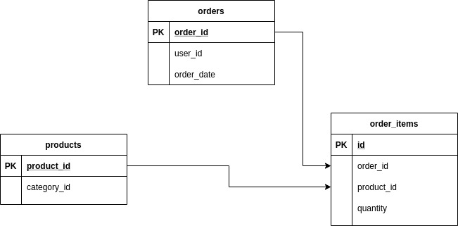
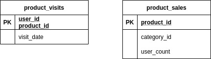

# Hepsiburada

# Running the Application
```
sudo docker-compose -f ./docker-compose.yml up -d
```

## Postgres
For simplicity, the source DB and API DB share the same database instance.
### data_db schema
Source Database



### api_db schema
Processed data is stored here to query via API.
- __product_visits__ is the source table for browsing history. It is being populated by streaming app.
- __product_sales__ is being populated by ETL job. Stores the distinct user count who bought each product in the last 30 days.



## Kafka
Contains one topic with the name `product-view`

## Data Producer Project
Reads the JSON file and pushes the data to Kafka to simulate streaming data.

## Etl Project
A Spark Job that reads orders from data_db and populates the api_db.product_sales table.

## Streaming Project
A Spark Streaming application that continuously runs and updates the latest product visits by the users.

## Api Project
A REST service (Node.JS application) with three endpoints : 
### GET browsing history
```
curl -X GET http://localhost:3000/browsing-history/user-41
```

### DELETE browsing history
```
curl -X DELETE http://localhost:3000/browsing-history/user-41/product-42
```

### GET best seller products for user 
```
curl -X GET http://localhost:3000/best-seller/user-41
```

### TODO
- The ETL project must be scheduled using Apache Airflow
- A temporary table will have used while populating the `api_db.product_sales` table to prevent the API from interruption.

